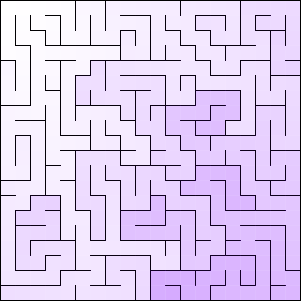

# maze-js
Maze Generators in JavaScript. The code comes from [Mazes for Programmers](https://pragprog.com/book/jbmaze/mazes-for-programmers), originally written in Ruby, ported to JavaScript and slightly modified to reflect my own idea. But the core logic is the same.

## Prerequisites
You will need [parcel](https://parceljs.org/getting_started.html) installed. If it's not installed in your system, install it first.

    $ npm install -g parcel-bundler

## Setup
Clone the project.

    $ git clone https://github.com/ntalbs/maze-js.git
    $ cd maze-js

## Running the maze
Run `parcel`:

    $ parcel index.html

This will run server on port `1234`. You can override the default port with the `-p <port_number>` option.

    $ parcel -p 4000 index.html

## Sample Image
Generated maze with **hunt-and-kill** algorithm.

